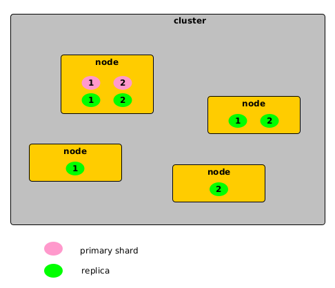

This document is a quick introduction to ElasticSearch.

It covers the basic usage from the command line, and the Python package [elasticsearch](https://elasticsearch-py.readthedocs.io/en/v7.14.0/).

> Installation for Debian: [Install Elasticsearch with Debian Package](https://www.elastic.co/guide/en/elasticsearch/reference/current/deb.html)

* [Management](doc/management.md)
* [Insert a document into ElasticSearch](doc/insert.md)
* [Delete a document](doc/delete.md)
* [Delete an index](doc/delete-index.md)
* [Select all documents from an index](doc/select-all-from-index.md)
* Example scripts in Python:
    * [Basic use cases](scripts/basic.py)
    * [Pagination tachniques](scripts/paginate.py): this script illustrates the 3 following techniques: "_from-to_", "_scrolling_" and "_search after_". 
* [Using wget instead of curl](doc/wget.md)
* [Tips and tricks](doc/tips-and-tricks.md)
* [SQL equivalent](doc/sql-equivalent.md)

How to run the scripts:

```shell
pipenv shell
pipenv install
cd scripts
```

Then you can execute the scripts: `python <name of the script>`.

# Analogy between RDBMs and ElasticSearch

| RDBMs    | ElasticSearch | 
|----------|---------------|
| database | index         |
| table    | type          |
| column   | document      |
| row      | property      |

> An index is a _logical_ view of data. Physically speaking, data is stored within _shards_.
>
> Searching for documents: `http://localhost:9200/[index]/[type]/[operation]`
  
# Cluster, nodes, index and shards

A cluster is made of a set of nodes:

    cluster = { nodes } 

An index is made of a set of shards:

    index = { shards }

* The shards are distributed over the nodes.
* There are 2 kinds of shards: primary shards and replicas.



